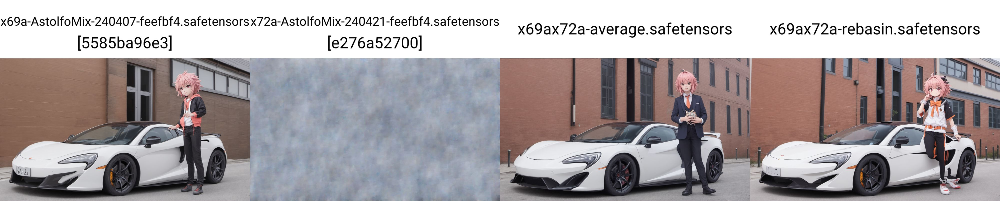

# Merge-Stable-Diffusion-models-without-distortion
I wrote the permutation spec for Stable Diffusion necessary to merge with the git-re-basin method outlined here - https://github.com/samuela/git-re-basin.
This is based on a 3rd-party pytorch implementation of that here - https://github.com/themrzmaster/git-re-basin-pytorch.

To merge, you may need to install pytorch 1.11.0 or lower (at some point, 1.12.0 did not work but the latest versions of pytorch may have resolved the issue). 

Download the code folder, open cmd in the directory, transfer the desired models to the same folder and run 
"python SD_rebasin_merge.py --model_a nameofmodela.ckpt --model_b nameofmodelb.ckpt"

If not in the same directory then 
pathofmodela.ckpt and pathofmodelb.ckpt instead

### Notes for SDXL by DammK ###
- Tested in A1111 WebUI 1.9.3 and [sd-mecha](https://github.com/ljleb/sd-mecha) 
- [The SDXL code only permutates a few layers.](https://github.com/vladmandic/automatic/blob/dev/modules/merging/merge_rebasin.py)
- [However the full permutation spec is present.](https://github.com/ogkalu2/Merge-Stable-Diffusion-models-without-distortion/issues/44). [OK, it turns out being entirely different.](https://www.diffchecker.com/WZKq6YiP/) I have posted a [text file](./docs/CLIP_G.txt) describing the **tensor size** of each layer. This implementation requires matching of tensor size.
- **No pruning even it may not crash.** WebUI extensions / nodes will break.
- **No CLIP fix has been revised.** Use other tools instead.
- **Will detect SD1.5 / SD2.1 / SDXL in auto.** 
- SD2.1 will be in partial support: **Both model structure must be identical.** [See this comparasion for differnce (SD2.1 vs WD1.4).](https://github.com/6DammK9/nai-anime-pure-negative-prompt/blob/main/ch03/v1/json/sd2_sd20_wd14.json) Use [toolkit](https://github.com/silveroxides/stable-diffusion-webui-model-toolkit-revisited) to inject the layers
- Then I'll try my best to analysis the effect. Will post to [this article about the algorithm](https://github.com/6DammK9/nai-anime-pure-negative-prompt/blob/main/ch01/rebasin.md) and [my mega mix which is 70+ in 1](https://github.com/6DammK9/nai-anime-pure-negative-prompt/blob/main/ch05/README_XL.MD)
- **~~Bonus task (probably impossible): Implement Algorithm 3 MERGEMANY~~** Probably infeasible, even with [sd-mecha](https://github.com/ljleb/sd-mecha/tree/main)'s well structured codebase. This implementation requires its own layer loading structre for iterlation. 

```sh
python SD_rebasin_merge.py --model_a _211-Replicant-V3.0_fp16.safetensors --model_b _220-realgarV20V21V21Yuri_v21.safetensors
```

- **SDXL will takes hours to merge! 6 minutes per permutation!** Default model name will be `merged.safetensors`.
```log
weight_matching in fp32:  33%|██████████████████▎                                    | 1/3 [12:07<24:15, 727.52s/it] 
Applying weighted_sum to special_keys: 100%|████████████████████████████████████████| 6/6 [00:00<00:00, 6009.03it/s] 
Main loop: 100%|████████████████████████████████████████████████████████████████| 10/10 [3:47:06<00:00, 1362.64s/it]

Saving...
Done!
```

- The final result (actually you can derive from paper) is *based from averaging* i.e. $(A\*0.5+B\*0.5)$. However similar to TIES and AutoMBW, it looks better from the plain averaging.

- Both comparasion are "avg / TIES-SOUP / avg(avg+TIES-SOUP) / rebasin(avg+TIES-SOUP)"




