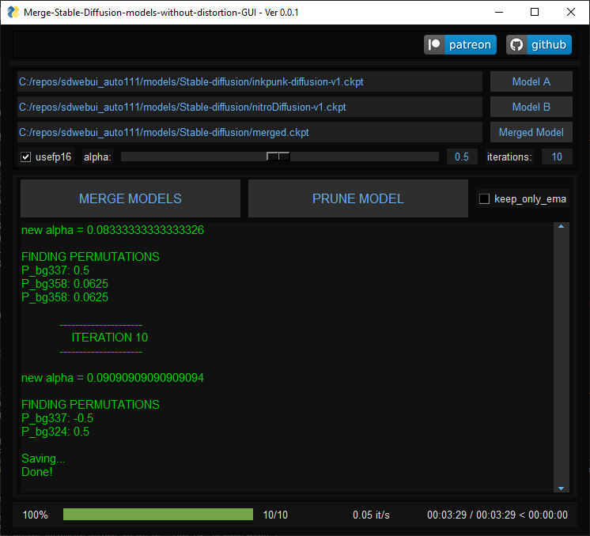
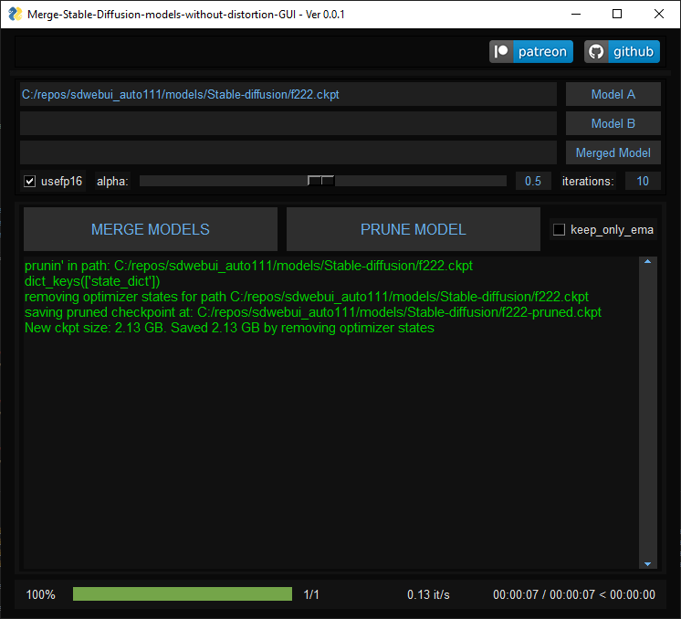

<div align="center">

  [](https://www.patreon.com/distyx)
  [](https://coindrop.to/disty)

  To continue to develop i will be happy to get some support.
  
## Merge-Stable-Diffusion-models-without-distortion-gui  
</div>


I created this simple GUI for this project because of some users requests.


This only GUI for the code as is, so if you have any issues related to the original code,
please refer to the original repository. I have not extensively tested the original code,
so the results may be unexpected.


If you encounter any issues with the GUI or think that it is implemented incorrectly,
please open an issue.

If you have any questions or concerns, please don't hesitate to ask for help.






[Windows Releases](https://github.com/diStyApps/Merge-Stable-Diffusion-models-without-distortion-gui)

Dev:
```
git clone https://github.com/diStyApps/Merge-Stable-Diffusion-models-without-distortion-gui
```
```
cd Merge-Stable-Diffusion-models-without-distortion-gui
```
```
conda env create -f conda.yaml
```
```
conda activate git_re_sd_wd_gui
```
```
pip install torch==1.11.0+cu113 torchvision==0.12.0+cu113 torchaudio==0.11.0 --extra-index-url https://download.pytorch.org/whl/cu113 scipy pytorch_lightning pysimplegui pandas
```
```
python run_app_gui.py
```

# Merge-Stable-Diffusion-models-without-distortion
I wrote the permutation spec for Stable Diffusion necessary to merge with the git-re-basin method outlined here - https://github.com/samuela/git-re-basin.
This is based on a 3rd-party python implementation of that here - https://github.com/themrzmaster/git-re-basin-pytorch.

The results of a model merge have not been tested yet but I am done with the spec.
To merge, you will need to install pytorch 1.11.0 or lower (1.12.0 will not work). 

Download the code folder, open cmd in the directory, transfer the desired models to the same folder and run 
"python SD_rebasin_merge.py --model_a nameofmodela.ckpt --model_b nameofmodelb.ckpt"

If not in the same directory then 
pathofmodela.ckpt and pathofmodelb.ckpt instead

CPU + GPU works now
